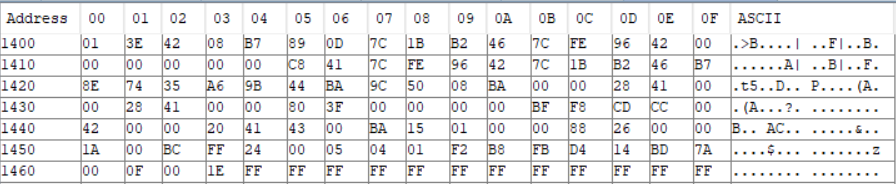

# Internal EEPROM Structure and Mapping

This file is a reference for the structure of the Microcontroller's EEPROM used by the Smart Window Security Sensor.

## Example of a Functioning EEPROM

## Memory Mapping

Without Angle Ranges: 0x1400 to 0x1464  
With Angle Range: 0x1400 to 0x1470

| Address | Variable Name | Type | Length | Description
| ------- | ------------- | ---- | ------ | -----------
| 0x1400  | MEM_EEPROM_LAYOUT_VERSION_ID | uint8_t | 1 byte | Version ID of the EEPROM Formatting. If the EEPROM is restructured, changing the value of `EEPROM_LAYOUT_VERSION_ID` will cause a mismatch at this location, triggering safe mode on the first power-up after the update.
| 0x1401  | MEM_DEVICE_ID1 | uint16_t | 2 bytes | 1st chunk of the device ID from MLX90632. Used to verify temperature settings.
| 0x1403  | MEM_DEVICE_ID2 | uint16_t | 2 bytes | 2nd chunk of the device ID from MLX90632. Used to verify temperature settings.
| 0x1405  | MEM_DEVICE_ID3 | uint16_t | 2 bytes | 3rd chunk of the device ID from MLX90632. Used to verify temperature settings.
| 0x1407 | MEM_P_R | float | 4 bytes | Cached constant `P_R` from MLX90632.
| 0x140B | MEM_P_G | float | 4 bytes | Cached constant `P_G` from MLX90632.
| 0x140F | MEM_P_T | float | 4 bytes | Cached constant `P_T` from MLX90632.
| 0x1413 | MEM_P_O | float | 4 bytes | Cached constant `P_O` from MLX90632.
| 0x1417 | MEM_EA | float | 4 bytes | Cached constant `EA` from MLX90632.
| 0x141B | MEM_EB | float | 4 bytes | Cached constant `EB` from MLX90632.
| 0x141F | MEM_FA | float | 4 bytes | Cached constant `FA` from MLX90632.
| 0x1423 | MEM_FB | float | 4 bytes | Cached constant `FB` from MLX90632.
| 0x1427 | MEM_GA | float | 4 bytes | Cached constant `GA` from MLX90632.
| 0x142B | MEM_GB | float | 4 bytes | Cached constant `GB` from MLX90632.
| 0x142F | MEM_KA | float | 4 bytes | Cached constant `KA` from MLX90632.
| 0x1433 | MEM_HA | float | 4 bytes | Cached constant `HA` from MLX90632.
| 0x1437 | MEM_HB | float | 4 bytes | Cached constant `HB` from MLX90632.
| 0x143B | MEM_VALIDATE | uint16_t | 2 bytes | XOR of the MLX90632 device IDs. Used to verify temperature settings.
| 0x143D | TEMP_WARNING_HIGH_LOCATION | float | 4 bytes | User-defined high temperature warning level. **Stored in Celsius, converted to other units at runtime.**
| 0x1441 | TEMP_WARNING_LOW_LOCATION | float | 4 bytes | User-defined low temperature warning level. **Stored in Celsius, converted to other units at runtime.**
| 0x1445 | TEMP_UNIT_LOCATION | char | 1 byte | User-defined temperature unit. Valid values are C, F, or K.
| 0x1446 | TEMP_MONITOR_SLEEP_ENABLE | bool | 1 byte | If set, the temperature is monitored in sleep.
| 0x1447 | MEM_MLX90392_ID | uint8_t | 1 byte | ID of the MLX90392 sensor. Used to verify magnetometer settings.
| 0x1448 | CRACKED_THRESHOLD_V | uint32_t | 4 bytes | Open/closed threshold value for the magnetometer.
| 0x144C | MAX_VALUE_V | uint32_t | 4 bytes | Maximum magnetic field intensity considered valid by the magnetometer.
| 0x1450 | MAGNETOMETER_OFFSET_X | int16_t | 2 bytes | DC offset of the magnetometer when the window is open in the X-axis.
| 0x1452 | MAGNETOMETER_OFFSET_Y | int16_t | 2 bytes | DC offset of the magnetometer when the window is open in the Y-axis.
| 0x1454 | MAGNETOMETER_OFFSET_Z | int16_t | 2 bytes | DC offset of the magnetometer when the window is open in the Z-axis.
| 0x1456 | MAGNETOMETER_SCALER_X | int8_t | 1 byte | Normalizing (scaling) factor for the X-axis measurements. See `README.md` for more information.
| 0x1457 | MAGNETOMETER_SCALER_Y | int8_t | 1 byte | Normalizing (scaling) factor for the Y-axis measurements. See `README.md` for more information.
| 0x1458 | MAGNETOMETER_SCALER_Z | int8_t | 1 byte | Normalizing (scaling) factor for the Z-axis measurements. See `README.md` for more information.
| 0x1459 | MAGNETOMETER_MAX_X | int8_t | 1 byte | Max normalized value allowed for X-axis measurements. Exceeding this value will trigger the alarm.
| 0x145A | MAGNETOMETER_MIN_X | int8_t | 1 byte | Min normalized value allowed for X-axis measurements. Values below this will trigger the alarm.
| 0x145B | MAGNETOMETER_MAX_Y | int8_t | 1 byte | Max normalized value allowed for Y-axis measurements. Exceeding this value will trigger the alarm.
| 0x145C | MAGNETOMETER_MIN_Y | int8_t | 1 byte | Min normalized value allowed for Y-axis measurements. Values below this will trigger the alarm.
| 0x145D | MAGNETOMETER_MAX_Z | int8_t | 1 byte | Max normalized value allowed for Z-axis measurements. Exceeding this value will trigger the alarm.
| 0x145E | MAGNETOMETER_MIN_Z | int8_t | 1 byte | Min normalized value allowed for Z-axis measurements. Values below this will trigger the alarm.
| 0x145F | SYSTEM_GOOD_MARKER | uint8_t | 1 byte | Marker to determine if general settings are valid.
| 0x1460 | SYSTEM_UPDATE_PERIOD | uint16_t | 2 bytes | Number of RTC cycles to wait before printing the system status.
| 0x1462 | SYSTEM_BLUETOOTH_IDLE_PERIOD | uint16_t | 2 bytes | Number of RTC cycles to wait before transitioning to low-power mode, if the alarm is OK and Bluetooth is not active.
| 0x1464 | MAGNETOMETER_MIN_XY | int16_t | 2 bytes | Min valid ratio of X/Y. **Not enabled by default.**
| 0x1466 | MAGNETOMETER_MAX_XY | int16_t | 2 bytes | Max valid ratio of X/Y. **Not enabled by default.**
| 0x1468 | MAGNETOMETER_MIN_XZ | int16_t | 2 bytes | Min valid ratio of X/Z. **Not enabled by default.**
| 0x146A | MAGNETOMETER_MAX_XZ | int16_t | 2 bytes | Max valid ratio of X/Z. **Not enabled by default.**
| 0x146C | MAGNETOMETER_MIN_YZ | int16_t | 2 bytes | Min valid ratio of Y/Z. **Not enabled by default.**
| 0x146E | MAGNETOMETER_MAX_YZ | int16_t | 2 bytes | Max valid ratio of Y/Z. **Not enabled by default.**
